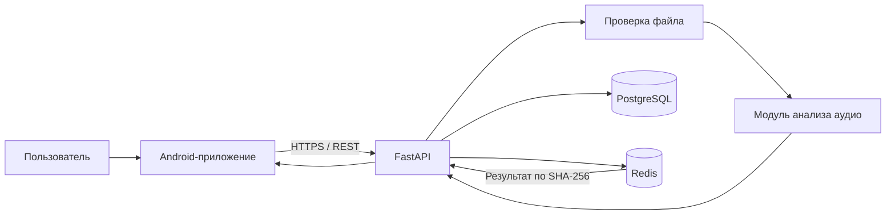
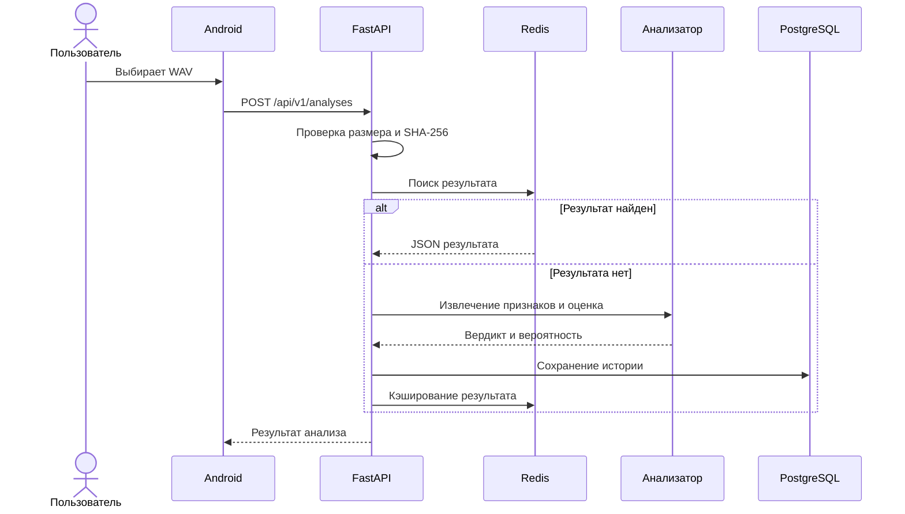

# Архитектура FAITH

## Компоненты

Android-клиент не подключается к базе данных напрямую. Все операции проходят
через REST API: это отделяет интерфейс от серверной логики и позволяет менять
модель анализа без выпуска новой версии приложения.

## Зачем используются PostgreSQL и Redis

PostgreSQL хранит постоянную историю проверок: имя файла, хеш содержимого,
вердикт, вероятность, версию модели и время операции. Redis хранит временную
копию результата по SHA-256 аудиофайла. При повторной отправке одинакового файла
сервер возвращает результат из Redis и не запускает вычисления повторно.

## Поток анализа

## Ограничение текущей версии

Первый этап использует объяснимый baseline по акустическим признакам. Он нужен
для проверки всей программной архитектуры. Для итоговой версии будет подключена
обученная модель, а в пояснительной записке будут указаны датасет, разбиение на
обучающую и тестовую выборки, метрики и ограничения классификатора.

