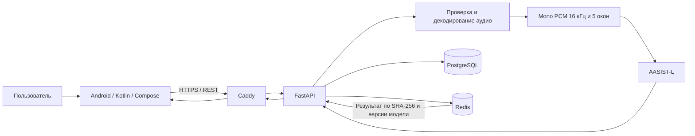
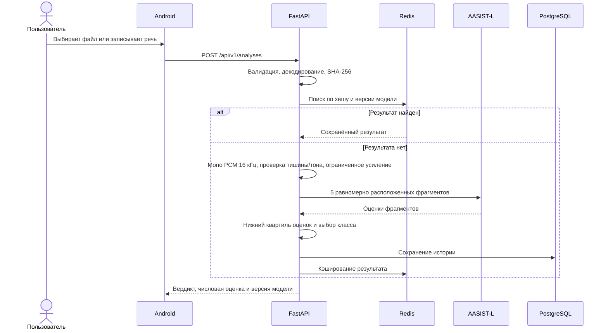

# Архитектура FAITH

## Назначение

FAITH — клиент-серверное Android-приложение для исследовательской оценки
происхождения речи. Клиент записывает или выбирает аудиофайл, передаёт его по
HTTPS и показывает числовую оценку сходства с синтетической речью вместе с
качественным пояснением. Оценка модели не является экспертным заключением или
статистически калиброванной вероятностью.

## Компоненты

Android-клиент не подключается к базе данных и модели напрямую. Все операции
проходят через версионированный REST API. Такое разделение позволяет обновлять
модель и правила обработки на сервере без выпуска новой версии приложения.

## Android-клиент

Клиент написан на Kotlin с Jetpack Compose. Он отвечает за выбор и запись аудио,
воспроизведение, отображение прогресса и результата, историю анализов и
авторизацию. Сетевые запросы выполняются через OkHttp. Токен сессии хранится с
использованием Android Keystore. Вход через Яндекс ID реализован официальным
Android LoginSDK; OAuth-токен проверяется backend, а не считается доверенным на
клиенте.

## Backend и хранение данных

FastAPI проверяет тип и размер файла, вычисляет SHA-256, выполняет авторизацию и
управляет запуском анализа. PostgreSQL хранит пользователей и постоянную историю
проверок: имя файла, хеш, вердикт, оценку, версию модели и время операции. Redis
хранит временный результат по комбинации SHA-256 и версии анализатора. Изменение
версии модели автоматически исключает использование результата старого алгоритма.

CPU-инференс запускается в отдельном рабочем потоке и ограничен одним
одновременным заданием, поэтому анализ не должен блокировать health check и
авторизацию.

## Поток анализа

Модель AASIST-L обучена на ASVspoof 2019 LA. Использование пяти равномерных окон
позволяет покрыть длинную запись, а нижний квартиль уменьшает влияние единичных
ложных срабатываний на артефакты телефонного кодирования. Тишина и простые
тональные сигналы отклоняются до инференса; для слишком тихой речи применяется
ограниченное усиление.

## Авторизация и ограничения текущей версии

Поддерживаются собственные учётные записи по email или номеру телефона и вход
через Яндекс ID. Для собственных учётных записей пароль хранится только в виде
защищённого хеша. Подтверждение владения email и номером телефона одноразовым
кодом пока не реализовано и относится к следующему этапу развития.

Схема базы сейчас обновляется версионируемым SQL-файлом. Для увеличения числа
миграций планируется переход на Alembic. Пороги классификатора требуют итоговой
валидации на отдельном размеченном наборе русской человеческой и синтетической
речи; подробнее методика описана в `model-evaluation.md`.
